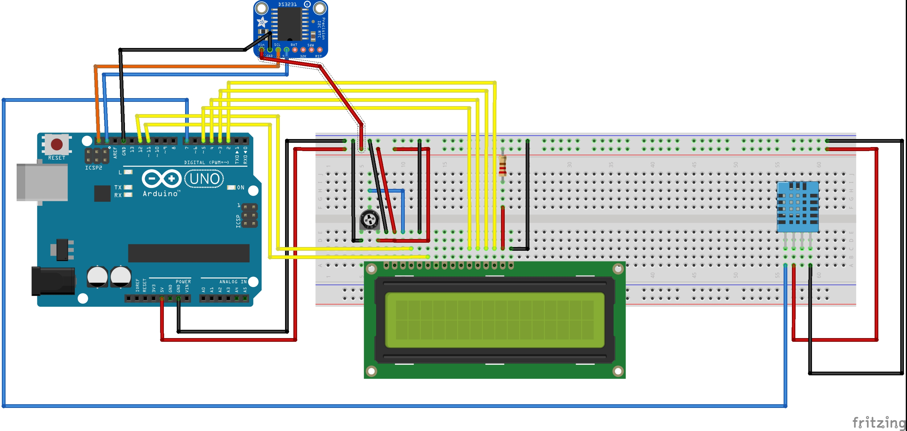

# Station-meteo
Réalisation d'un montage affichant les informations de date et de météo.

## Video

cliquer sur la photo pour lire la video

# Schema du montage

# Bibliothèque a utiliser

include <DHT.h>

include <DHT_U.h>

include <Adafruit_Sensor.h>

include <LiquidCrystal.h>

include <Wire.h>

include <RtcDS3231.h>

# Liste des composants

+ 1 Arduino UNO
+ 1 cable usb Arduino
+ 1 Bread Board
+ 1 Horloge RTC (DS3231)
+ 1 Ecran LCD 16*2
+ 1 resistance 2K
+ 1 potentiometre 3 broche
+ 1 Capteur de témpérature (DHT11)
+ 1 Horloge RTC (DS3231)
+ 19 cables male/male
+ 4 cables male/femelle

